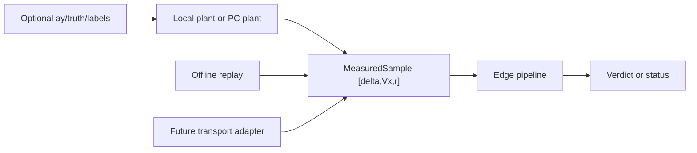

# Phase 0 interface contract

Status: implemented for the three-input deployment contract.

This contract separates the signals required by the Raspberry Pi edge
pipeline from simulator and analysis data. The edge pipeline consumes
`[delta, Vx, r]`; `ay`, labels, and plant states are optional diagnostics only.

## Versioning

| Field | Value | Meaning |
|---|---:|---|
| `schema_version` | 1 | Sample and replay envelope |
| `units_version` | 1 | SI units and sign conventions |
| `feature_version` | 1 | H1 selected 18-feature contract |
| `model_version` | 0 | No trained model is required by Phase 0 |

Consumers accept the same major schema version and reject unsupported major
versions. Feature and model versions are checked when those artifacts are
present.

## Required measured sample

Each sample has the following required fields:

| Field | Type | Unit | Convention |
|---|---|---|---|
| `delta` | finite float | rad | Front-wheel angle, positive left |
| `Vx` | finite float | m/s | Longitudinal speed, positive forward |
| `r` | finite float | rad/s | Yaw rate, positive counter-clockwise |
| `timestamp_s` | finite float | s | Seconds from stream start |
| `sequence` | non-negative integer | samples | Starts at zero and increases |
| `schema_version` | integer | — | Must be supported |

The canonical channel order is `[delta, Vx, r]`. A producer may include an
optional `diagnostics` object, but diagnostics are never forwarded to the
detector.

### Optional diagnostics

Diagnostics may contain `ay`, model states, parameters, disturbances, labels,
or provenance. They are useful for plant validation and replay analysis, but
are not part of the edge input contract. A sample without `ay` is valid.

## Timing and quality policy

The nominal rate is 100 Hz with a 0.01 s period. Timestamps must be
non-decreasing and sequences must be strictly increasing. The default
accepted timing tolerance is ±2 ms.

- A timestamp or sequence gap is reported as `gap` and the current sample is
  still forwarded. The edge does not silently interpolate.
- A late sample (timestamp earlier than the previous sample) is rejected as
  `late`.
- A duplicate sequence or timestamp is rejected as `duplicate`.
- A non-finite required value, missing required field, or unsupported schema is
  rejected as `invalid`.
- Quality decisions are returned as structured statuses, not hidden in logs.

The first sample has timestamp zero and sequence zero for local and replay
sources. A transport adapter must preserve the same semantics.

## Source and edge boundaries



Sources implement iteration over samples. The edge pipeline owns validation,
buffering, detection, features, model inference, aggregation, and verdict
state. No source or transport implementation is imported by the contract
module.

The lifecycle is:

1. `start()`
2. `push(sample)` for each sample
3. `flush()` at end of stream
4. `reset()` between independent streams
5. `close()` when the consumer is no longer needed

Phase 0 uses a placeholder consumer. Phase 1 will attach the detector behind
the same boundary.

## Verdict contract

A verdict event contains:

- `class_probabilities`: four probabilities in the order
  `nominal`, `A`, `B`, `A+B`;
- optional `delta_m_kg` and `k_f` regression values;
- `confidence`;
- `turn_index` and `window_id`;
- `timestamp_s`;
- detector state and validity/status.

Before the detector is implemented, the pipeline returns `no_verdict` while
still reporting sample acceptance and timing status. Invalid input does not
change detector state.

## Feature contract

The deployable H1 feature vector contains 18 features selected by
`scripts/select_features.m`. Its names and order are sourced from
`change_detector.turnFeatureNames()` and the selected feature metadata; they
must be exported with the model artifact and never reconstructed by position
in Python.

The exploratory MATLAB `turnFeatures` function currently computes 35 features,
including `ay`-derived features. That function remains an offline analysis
implementation in Phase 0. The Phase 1 deployable feature port must use the
selected 18-feature list and the three required measured inputs.

Feature normalization uses exported `mu` and `sigma`. Non-finite features are
invalid; zero scale values must be represented explicitly and handled
deterministically by the model adapter.

## Model artifact

The planned `models/export/weights.mat` artifact contains:

`mu`, `sigma`, `featureNames`, classifier layers (`W1`, `b1`, `W2`, `b2`,
`W3`, `b3`), regressor layers (`V1`, `c1`, `V2`, `c2`, `V3`, `c3`), and
`classNames`.

Dummy weights are permitted for Phase 0 plumbing. Training and model loading
are not Phase 0 responsibilities.

## Replay format

MATLAB is the initial producer of `.mat` replay fixtures. The runtime section
contains only:

- `schema_version`, `units_version`, `feature_version`, `model_version`;
- `sample_rate_hz`, `channel_order`, timestamp convention, source, and seed;
- `timestamp_s`, `sequence`, `delta`, `Vx`, and `r`.

Expected features, probabilities, regressions, and verdict events are reserved
for Phase 3. Truth signals, `ay`, and labels may be stored under diagnostics
but are not read by the edge pipeline.

## Execution modes

- `offline`: source owns the clock; processing runs as fast as possible and
  must be deterministic.
- `realtime`: source paces samples against wall-clock time; the same pipeline
  and consumer code are used.

The execution mode does not change validation, feature semantics, or verdict
logic. Network connectivity is not required for either mode.

## Examples

Valid runtime sample:

```json
{
  "schema_version": 1,
  "timestamp_s": 0.01,
  "sequence": 1,
  "delta": 0.02,
  "Vx": 4.17,
  "r": 0.01
}
```

Producer record with optional diagnostics:

```json
{
  "schema_version": 1,
  "timestamp_s": 0.01,
  "sequence": 1,
  "delta": 0.02,
  "Vx": 4.17,
  "r": 0.01,
  "diagnostics": {"ay": 0.04, "label": "nominal"}
}
```

The two records are equivalent to the edge consumer.
