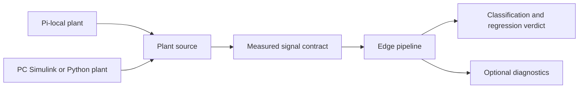

# Pi Deployment Implementation Plan

## Goal

Complete the Track C demo with an architecture that supports both:

1. **Co-located mode:** the plant and classifier run on the same hardware, initially on the Raspberry Pi.
2. **Separated mode:** a plant runs on a PC and sends the measured signal stream to a Pi running the edge detector and classifier.

The classifier must not depend on where the signal samples originate. Both modes should use the same sample schema, detector, feature extraction, model inference, and verdict format.

## Target architecture



### Stable boundaries

- **Plant boundary:** produces measured samples `[delta, Vx, r, ay]` at 100 Hz, plus optional timestamps and diagnostics.
- **Transport boundary:** delivers measured samples to the edge pipeline. Local in co-located mode; network/serial/other transport in separated mode.
- **Edge boundary:** owns buffering, turn detection, features, model inference, aggregation, and verdicts.
- **Training boundary:** MATLAB/Simulink remains responsible for dataset generation, feature exploration, model training, and weight export.

The first implementation should use an in-process/local sample source. The edge pipeline should consume the same iterator/callback/queue interface that a future streaming transport will implement.

## Phase 0 — Lock interfaces and execution contracts

Define before implementing the remaining modules:

- Sample format, units, sample rate, timestamp behavior, and handling of dropped/late samples.
- Plant output contract for both local simulation and PC streaming.
- Edge input/output API and verdict schema.
- Feature ordering and normalization contract.
- Model weight export format.
- Deterministic replay/test-vector format.
- Configuration for real-time versus accelerated/offline execution.

**Exit criteria**

- A short interface document exists.
- Local samples can be fed to the edge pipeline without the edge code knowing their source.
- Transport is explicitly replaceable rather than embedded in detector logic.

## Phase 1 — Complete the deployable classifier pipeline

Implement the missing Pi modules described in `plan.md`:

- `pi/features.py`: line-by-line port of MATLAB `turnFeatures`.
- `pi/detector.py`: ring buffer, turn-entry/exit state machine, feature invocation, and K-turn aggregation.
- `pi/model.py`: NumPy forward pass for classifier and regressors, loading exported weights.
- `pi/noise.py`: deterministic simulated sensor noise for local demonstrations.
- `pi/app.py`: command-line entry point and verdict display.

In parallel, implement the MATLAB-side prerequisites:

- `change_detector.findTurns`
- `change_detector.turnFeatures`
- `change_detector.mlpForward`
- `change_detector.detectorStep`
- Feature generation, model training, and `weights.mat` export scripts.

Use dummy weights initially so plumbing can be tested before model training is complete.

**Exit criteria**

- A Python sample stream reaches a verdict without network connectivity.
- The Python model forward pass agrees with MATLAB on fixed feature vectors.
- The detector uses only measured signals and does not consume labels or simulator internals.

## Phase 2 — Same-hardware end-to-end demo

Make the co-located path the first complete demonstration:

```text
Pi-local plant -> optional noise -> edge detector -> classifier/regressor -> verdict display
```

Tasks:

- Add a local plant source that drives `pi/plant.py` with a nominal-to-changed scenario.
- Add configurable step and ramp changes, including rear ballast and front tire stiffness scenarios.
- Connect the plant output to the same edge input API used by future streaming.
- Add terminal output and, if time permits, a lightweight live plot/dashboard.
- Measure real-time factor and memory use on the actual Pi.
- Verify that verdict timing and output match MATLAB/Simulink reference results.

**Exit criteria**

- `pi/app.py` runs the complete demo on the Pi.
- Plant and classifier both run in real time with margin.
- A mid-run change is detected within the expected number of turns.
- The same input produces matching verdicts in MATLAB, Python, and Simulink replay where available.

Phase 2 implementation status:

- `python -m pi.app --local` runs the deterministic Python plant through the
  same `ArraySampleSource` and `EdgePipeline` path used by replay sources.
- `A`, `B`, and `AB` scenarios mirror the MATLAB mass/CG/inertia and `Caf`
  changes; constant, step, ramp, and reverse schedules are supported.
- `pi/benchmark_local_demo.py` reports real-time factor, peak memory, sample
  count, and final verdict timing. The checked-in host measurement is about
  0.032 real-time factor for a 167.36 s stream with 21.2 MiB peak Python
  allocation; repeat it on the target Pi before presentation.
- `pi/test_local_demo.py` covers source determinism, contract isolation,
  scenario endpoints, bounded history, and three-turn local verdict output.

## Phase 3 — Replay and parity validation

Build a deterministic validation path before adding network transport:

- Export measured input streams, expected features, probabilities, regression outputs, and verdict sequence from MATLAB.
- Add `pi/test_detector_parity.py`.
- Test at least one representative run for nominal, A, B, and A+B.
- Test both step and ramp demo scenarios.
- Verify behavior at the nominal sample rate and with controlled sample timing.

**Exit criteria**

- Feature and model tolerances are defined and pass.
- Verdict sequences match across implementations.
- Failures identify whether the issue is windowing, features, model loading, or aggregation.

Phase 3 implementation status:

- `scripts/export_phase3_replay_vectors.m` generates MATLAB reference fixtures
  for nominal, A, B, and A+B constant runs, plus deterministic step and ramp
  runs. Each `pi/test_vectors/detector_*.mat` fixture contains the measured
  edge channels, selected per-turn features, per-turn model outputs, and the
  MATLAB streaming verdict sequence.
- Python parity checks use `rtol=1e-6` for selected features and `rtol=1e-5`
  for model and aggregated verdict values, with `1e-8` absolute tolerance.
- `python -m unittest discover -s pi -p "test_*.py"` passes the complete
  package-safe Pi suite. `python pi/test_plant_parity.py` remains the
  standalone plant parity command.
- The four class replays and both transition replays match MATLAB for turn
  timing, class sequence, probabilities, and available regression outputs.

## Phase 4 — Separated PC plant and Pi edge device

Implementation status: complete for the initial TCP/JSON transport prototype.
The protocol and operations are documented in
[phase-4-transport.md](phase-4-transport.md). The separated mode remains
optional; local and replay modes use the same edge pipeline.

Add a transport adapter without changing the edge pipeline:

```text
PC plant -> sample serializer -> transport -> Pi sample receiver -> edge pipeline
```

Recommended order:

1. In-process queue or loopback adapter for integration testing.
2. File/replay adapter for repeatable debugging.
3. Network adapter, preferably a simple framed UDP or TCP protocol selected during detailed planning based on demo constraints.

Transport concerns to address:

- Sequence number and timestamp.
- Fixed signal units and endianness/serialization.
- Startup handshake and configuration version.
- Buffering and back-pressure.
- Dropped, duplicated, late, or out-of-order samples.
- Connection loss behavior and visible stale-data status.
- Optional simulated latency and packet loss for testing.

The PC plant may initially be Simulink; a Python plant can be added later for simpler packaging and automated integration tests.

**Exit criteria**

- The Pi classifies a PC-generated stream using the same edge code as co-located mode.
- Transport failures are detected and reported without corrupting verdict state.
- The separated demo is optional and does not regress the local demo.

## Phase 5 — Demo hardening and presentation

- Provide one command/configuration for co-located mode.
- Provide one command/configuration for separated mode.
- Document required MATLAB/Simulink, Python, NumPy/SciPy, and Pi setup.
- Include a prerecorded fallback stream in case live PC-to-Pi transport is unreliable.
- Add clear status for plant mode, sample age, detector state, latest verdict, and confidence.
- Capture performance numbers and parity results for the presentation.

**Exit criteria**

- A fresh operator can run the local demo from the documentation.
- The separated demo can be enabled without code changes.
- A prerecorded replay provides a reliable fallback.

## Dependencies and priority

### Must have

- MATLAB feature/model export path.
- Python features, detector, model, and app.
- Same-hardware Pi demo.
- Deterministic parity tests.

### Should have

- Simulink replay parity.
- Regression outputs for mass and tire stiffness.
- Live diagnostics/dashboard.
- PC-to-Pi transport prototype.

### Stretch

- Robust packet-loss handling and reconnect.
- Live PC Simulink streaming.
- Full performance dashboard.
- Automatic mode selection and remote configuration.

## Risks and decisions deferred to detailed planning

- Choose transport protocol only after the local pipeline and sample contract are stable.
- Keep the plant source and transport behind adapters; do not duplicate detector logic for local and remote modes.
- Treat network connectivity as optional because the project requirement is offline Pi operation.
- Preserve deterministic replay so transport and classifier issues can be debugged independently.
- Do not move training or dataset access onto the Pi; deploy only exported weights and runtime code.
