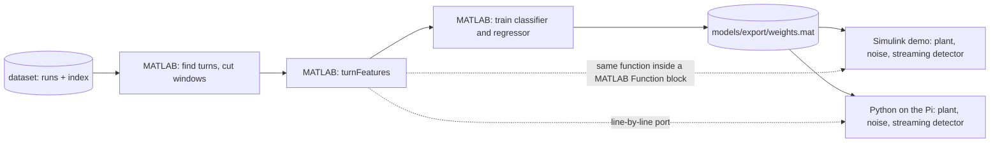

# Plan: Detecting tractor property changes with a bicycle model on a Raspberry Pi

**Summary:** Detect and quantify changes in tractor properties (mounted ballast/implement, front tire stiffness) from onboard signals, using a 3-state bicycle model ($\dot y$, $\dot\psi$, $\alpha_f$) as the simulator and small neural networks as classifier and regressor. Everything is built in MATLAB/Simulink and runs fully offline on a Raspberry Pi (no connectivity needed). The plant is driven directly by the measured front wheel angle, so no steering actuator model is needed. The trajectory is open-loop: 3 swaths, each a near-straight line at 15 km/h with soil and terrain disturbances, followed by an end-of-row omega turn at 5 km/h (as in the real logs).

Work is split into a **preparation phase (now)**, which delivers a validated simulator and a labelled raw dataset, and the **hackathon day**, which covers features, training, the Simulink inference model and the Pi demo. Several conclusions below are hand calculations from the parameter file; the preparation phase checks them.

## Signals (glossary)

| Symbol | Meaning | Source | Seen by classifier |
|---|---|---|---|
| $\delta$ | Front wheel steering angle (positive left) | Steering angle sensor | Yes (plant input, plus small sensor noise) |
| $V_x$ | Longitudinal speed | Wheel speed / radar / GNSS | Yes (plant input) |
| $r = \dot\psi$ | Yaw rate (positive counter-clockwise) | Gyro z-axis of the IMU | Yes |
| $a_y$ | Lateral acceleration at the IMU, $\ddot y + V_x r$ plus lever-arm terms | Accelerometer y-axis | Yes |
| $\dot y$, $\alpha_f$ | Lateral velocity, front slip angle | Model states | No (not measured) |
| $X, Y, \psi$ | Position and heading | Integrated kinematics | No (plots only) |

## Key physics finding: what each speed contributes (straights 15 km/h, turns 5 km/h)

These are rough estimates using [arion_630_parameters.m](arion_630_parameters.m) ($L=2.81$ m, $K_{us}\approx-0.005$ rad/(m/s²) nominal):

| Speed | $K_{us}V_x^2$ relative to $L$ (steady-state effect) | Yaw lag $\tau$ nominal | $\tau$ with +1.5 t rear |
|---|---|---|---|
| 5 km/h (1.39 m/s) | 0.4 % | 0.29 s | 0.11 s |
| 10 km/h (2.78 m/s) | 1.4 % | 0.15 s | 0.06 s |
| 15 km/h (4.17 m/s) | 3.2 % | 0.10 s | 0.04 s |

- **Steady-state turning:** the yaw gain is $\frac{V_x/L}{1+K_{us}V_x^2/L}$ times $\delta$. In the 5 km/h turns this is practically kinematic, so the steady part of the turn carries almost no information. At 15 km/h, +1.5 t on the rear changes $K_{us}$ from about −0.005 to about −0.010, a yaw-gain change of about 3 %. On the straights the only steering is the small operator corrections, so this effect is only visible if those corrections are large enough (see step 4).
- **Transients:** at low speed the rear tire damping dominates, and the yaw response is roughly a first-order lag:

  $$\tau \approx \frac{C_{ar}\,l_r^2\,\sigma_f}{C_{af}\,l_f^2\,V_x}$$

  At 5 km/h this lag is the strongest single signal: +1.5 t on the rear cuts it from about 0.29 s to about 0.11 s. It is observable at 100 Hz sampling because the measured wheel angle is the model input, so no actuator delay sits in between.
  - **Mass alone can't be identified from the lag:** $m$ and $I_{zz}$ nearly cancel out of $\tau$.
  - **Centre-of-gravity shift can be identified:** it enters as $(l_r/l_f)^2$.
- **Two speeds add information:** the steady-state term scales with $V_x^2$ and the lag with $1/V_x$. Turn-in and turn-out lags at 5 km/h plus small-signal gain on the 15 km/h straights give two different combinations of the parameters, which helps tell A from B.
- **Front tire changes can be identified,** but mostly as the ratio $C_{af}/\sigma_f$ in the lag; $C_{af}$ also enters $K_{us}$ on its own. Treat $C_{af}$ and $\sigma_f$ as one "front tire stiffness factor".
- **Speeds:** straights at 15 km/h (a realistic sprayer or spreader working speed), end-of-row turns at 5 km/h, matching the real logs. Lateral acceleration in the turn is only about 0.2 m/s² at $R$ = 9 m, so the tires are deep in the linear range.
- **Main risk:** ballast that moves the CG forward and a softer front tire both make $\tau$ larger, so they may be hard to tell apart. The preparation phase checks this (step P6).
- **Side notes:**
  - The nominal parameters describe a mildly oversteering vehicle (critical speed about 23 m/s). That's fine in the field.
  - The file computes $I_{zz}=m\,l_f\,l_r$. Ballast scenarios must update $m$, $l_f$, $l_r$ and $I_{zz}$ together (parallel-axis rule).

## Recommended targets (at most 2)

- **A. Mounted ballast or implement:** added mass $\Delta m$ at a known mount point (rear 3-point hitch, or front weight). From it, compute the new $m$, CG, and $I_{zz}$. Report $\Delta m$ and the CG shift. A towed cart is a different case: it makes the vehicle articulated, which the bicycle model doesn't cover.
- **B. Front cornering stiffness factor** $k_f = C_{af}/C_{af,0}$, for tire pressure, tire type or soil changes.
- **Fallbacks if P6 shows A and B can't be separated:** rear cornering stiffness, or reduce the task to classifying the direction of change (front-heavy vs rear-heavy vs tire).

## Sudden or slow changes?

- **Sudden (step) changes are simpler and the primary target:** for example attaching or removing a mounted implement or front weight, or changing tire pressure. Parameters are constant within each window, labels are clean, and every window gets exactly one answer.
- **Slow changes (drift)** such as a mounted sprayer tank draining or a mounted hopper filling: parameters vary inside a window, labels are time-varying, and you need tracking rather than classification.
- **Recommendation:** train on piecewise-constant parameters only. Because the regressor outputs a magnitude per window, a slow drift then shows up for free as a sequence of window estimates (for example $\Delta m$ decreasing from turn to turn while a tank drains). Generate a few drift runs in preparation, but use them only as a demo and stretch goal, not for training.

## Is the estimator overkill?

No, as long as it's just a regression output on the same features (two extra outputs, negligible effort). A full online estimator (EKF, recursive least squares) would be overkill. As an offline baseline and sanity check, add a per-window grey-box fit of the two parameters with `fminsearch` (base MATLAB; Optimization and System Identification toolboxes are not installed).

## Toolboxes (checked in MATLAB R2024b)

- **Installed:** MATLAB, Simulink, Control System, Signal Processing, Deep Learning, Simscape, Simscape Multibody. Statistics and Machine Learning is also available.
- **Not installed:** System Identification, Optimization, Parallel Computing, MATLAB Coder, Simulink Coder, Embedded Coder.
- **Consequences:**
  - Statistics and Machine Learning serves exploration and model selection (feature ranking with `fscmrmr`, quick baselines with `fitcensemble`, `fitcnet`, `fitclinear`, `fitcdiscr`). The deployed models must be easy to port by hand: small MLPs (`fitcnet`/`fitrnet` or Deep Learning Toolbox `trainnet`) or linear models. No tree ensembles on the Pi.
  - Data generation runs serially with `sim` and Fast Restart (no `parsim`).
  - Control System Toolbox (`ss`, `lsim`) serves to cross-check the Simulink plant.
  - **Raspberry Pi deployment is a manual port** (no code generation). See H5.

## Inference architecture: buffer → features → classifier

Yes, that's the right structure. Recommended details:

- **Buffer:** a ring buffer of the 4 measured signals ($\delta$, $V_x$, $r$, $a_y$) at 100 Hz, holding the last 60 s or so (about 24 000 values), enough for a full omega turn plus margins.
- **Trigger:** event-based rather than "buffer full". When a turn ends (|$\delta$| falls back below a threshold with hysteresis), take the window from about 5 s before turn entry to about 5 s after turn exit, plus a summary of the preceding straight. Every window then contains the same kind of manoeuvre, which makes features much more consistent.
- **Fallback:** fixed sliding windows (e.g. 30 s, hop 10 s). Simpler, but windows mix straights and turns, so the classifier has to cope with very different content.
- Because the dataset stores labels per sample (P7), both windowing schemes can be tried on hackathon day.

## Frequency-band features

Yes, in two bands that match the physics:

- **Low band (below about 0.2 Hz):** steady-state yaw gain and $a_y / (V_x r)$. This carries the understeer change ($K_{us}$), mainly on the 15 km/h straights.
- **Mid band (about 0.2–1.5 Hz, extend to about 3 Hz after the P6 finding):** gain and phase of $\delta \to r$ and the frequency and height of the lightly damped mode at 1.1–1.4 Hz. This is excited by the turn ramps and the disturbances.
- **High band (above about 3 Hz):** mostly sensor noise and vibration with no parameter information. Use it at most to normalise for the noise level.
- **Implementation:** fixed IIR band-pass filters (coefficients designed once offline with Signal Processing Toolbox and stored as constants) plus band power and cross-power. On the Pi, `filter` maps one-to-one to `scipy.signal.lfilter`. `tfestimate` is fine for offline exploration but stays off the deployment path.
- **Portability rule for all deployed feature code:** only basic operations (filter with fixed coefficients, sums, max, cross-correlation written out explicitly), so the Python port is line-by-line.

## Preparation phase (now): validated simulator and labelled raw dataset

**Goal:** arrive at the hackathon with a trustworthy simulator and all raw data, so the day can focus on features, training and the Pi demo. The dataset stores **raw time series with per-sample labels, not features**, so feature design stays open on the day. Two cheap checks (P6 and P8) make sure the data actually contains the signal before you commit to generating everything.

**Progress** (tick a box only when the task is complete and its check has passed):

- [x] P1. Project skeleton
- [x] P2. Trajectory: steering angle and speed profile
- [x] P3. Simulink plant model
- [x] P4. Plant verification
- [x] P5. Trajectory check
- [x] P6. Detectability and separability check (go/no-go) — decision: A restricted to rear-hitch mounts
- [x] P7. Scenario grid, labels and data generation — 1420 runs, `scripts/check_dataset.m` passes
- [x] P8. Smoke test of a single feature — turn-in lag does not separate, spectral features do (see P8 results)
- [x] P9. Storage — `data/tractor_dataset.zip` (0.93 GB, contains `runs/`, `index.mat`, `config.mat`); upload to Google Drive pending
- [ ] P10. Pi readiness — `pi/plant.py` ported and passing the parity test on this PC; Pi-side run still open

### P1. Project skeleton
- Folders: `+change_detector/` (functions), `models/` (Simulink), `scripts/`, `data/`.
- `change_detector.nominalParams()` wraps [arion_630_parameters.m](arion_630_parameters.m) (which itself needs `tf2ss_observable` from the icons-engineering-toolbox on the MATLAB path). It also fixes the IMU at the rear axle (assumption; the file has no IMU position).
- `change_detector.applyScenario(p0, scen)` turns a scenario ($\Delta m$, mount position, $k_f$, soil variation) into a consistent parameter set: $m$, $l_f$, $l_r$, $I_{zz}$ via the parallel-axis rule, $C_{af}$, $C_{ar}$, $\sigma_f$. Tire stiffness does not change with added load; $k_f$ scales $C_{af}$ only, $\sigma_f$ stays constant.
- `change_detector.bicycleMatrices(p, Vx)` and `change_detector.simulatePlant(prof, dist, p0, p1, sched)` are the linear model and the Simulink wrapper used by all checks.

### P2. Trajectory: steering angle and speed profile
- `change_detector.makeManeuverProfile(cfg, seed)` returns $\delta(t)$ (the front wheel angle directly; no actuator model) and $V_x(t)$ at 100 Hz:
  - **3 swaths:** straight → end-of-row turn, repeated 3 times. The net turn direction alternates L, R, L.
  - **Straight:** about 100 m at 15 km/h (4.17 m/s), about 24 s. Steering near 0° plus operator corrections (band-pass noise 0.1–0.5 Hz, so heading stays bounded like a real operator holding the row; amplitude randomised per run at about 0.5–1.5° std, which matches the real logs). These corrections are the only excitation at 15 km/h; below about 0.3° the yaw response would get lost in gyro noise.
  - **Speed transitions:** 15 → 5 km/h at about 0.5 m/s² before each turn (about 5.5 s), and back up after it.
  - **End-of-row omega turn at 5 km/h (1.39 m/s)**, the primary turn type. It's the standard turn when the working width $w$ is smaller than the minimum turning diameter (about 16.4 m), which fits implements typical for an Arion 630 class tractor (3–6 m).
    - **Geometry:** three arcs of radius $R$: away from the next lane by $\beta$, towards it by $180^\circ + 2\beta$, away again by $\beta$. The tractor lands exactly on the next lane when $w = R(4\cos\beta - 2)$, i.e. $\beta = \arccos\frac{w/R + 2}{4}$. Example: $w$ = 6 m, $R$ = 9 m gives $\beta \approx 48^\circ$, about 59 m of path and about 42 s at 5 km/h.
    - **Steering:** $0 \to -\delta_t \to +\delta_t \to -\delta_t \to 0$ with $\delta_t = L/R$ (17.9° at $R$ = 9 m; the plant is linear, so no $\arctan$), raised-cosine ramps with peak rate 22 °/s (limit 25 °/s), $|\delta| \le 19^\circ$ (real steering limits). That is about 100° of total steering travel per turn, versus about 35° for a U-turn, including two full-lock reversals through zero. These reversals are the best mid-band excitation for the yaw-lag features, and having both signs in every turn helps cancel gyro bias.
  - **U-turn variant:** a single semicircle that skips a lane ($w = 2R$). It's the same generator with $\beta = 0$. The optional short straight between two quarter circles was left out. It is drawn per turn for about 30 % of turns so the features don't depend on one turn shape.
  - **Not used:** K-turns or fishtail turns. They need reversing and stopping, and the model has $1/|V_x|$ terms that become singular at standstill.
  - **Total run:** about 230 s with omega turns.
  - **Randomise per run:** straight length ±20 %, straight speed 13–16 km/h, turn speed 4–6 km/h, $R$ in 8.5–11 m, working width 3–6 m, turn type (about 70 % omega, 30 % U-turn), first turn direction, operator-correction seed.
- `change_detector.makeDisturbance(t, cfg, seed)`: soil and terrain effects as zero-mean band-pass noise (0.05–2 Hz) entering as lateral force $F_{y,d}$ (800 N std) and yaw moment $M_{z,d}$ (400 Nm std). **The amplitudes are assumptions**, they were sized so heading drifts only a fraction of a degree per straight and they set how strongly the lightly damped mode is excited (see P6). Calibrate against the real logs if available.

### P3. Simulink plant model `models/tractor_plant.slx`
- Fixed-step `ode4`, 0.01 s. All MATLAB Function blocks compatible with code generation.
- **Inputs:** $\delta$, $V_x$, $F_{y,d}$, $M_{z,d}$ from From Workspace or `setExternalInput`.
- **Parameter Scheduler:** outputs a parameter bus. Modes: constant, step at `t_change`, or linear ramp between `t_start` and `t_end` (for the drift demo runs).
- **Tractor Plant:** a MATLAB Function block evaluates the 3-state bicycle equations with front tire relaxation (derived from the parameter file; the equations from the image are not in the workspace, **please compare them with the header of [bicycleMatrices.m](+change_detector/bicycleMatrices.m)**), followed by one Integrator for $[\dot y, \dot\psi, \alpha_f, X, Y, \psi]$.
- **Outputs (clean, without sensor noise):** $\delta$, $V_x$, $r$, $a_y$ at the IMU position, $\dot y$, $\alpha_f$, X, Y, ψ, and the true parameter signals ($m$, $l_f$, $l_r$, $I_{zz}$, $C_{af}$, $C_{ar}$, $\sigma_f$).
- **Sensor noise is added afterwards** by `change_detector.addSensorNoise(run, noiseCfg, seed)`: gyro about 0.01 rad/s, accelerometer about 0.2 m/s² plus vibration, steering angle about 0.2°, plus biases. Keeping noise out of the stored data lets you change noise levels on the day without re-simulating.

### P4. Plant verification (`scripts/check_plant.m`)
- Simulink output matches `lsim` of the same `ss` model (Control System Toolbox) at constant $V_x$: below 1e-6 relative at a 1 ms step (equations identical), below 4e-5 at the production 10 ms step (RK4 integration error, largest on $a_y$ at 5 km/h). The Pi parity test therefore compares against the 10 ms Simulink run, not `lsim`.
- The steady-state yaw rate in a constant-steering turn matches the analytic $\frac{V_x\delta}{L + K_{us}V_x^2}$.
- A parameter step at `t_change` shows up in the parameter signals and in the response.

### P5. Trajectory check (`scripts/check_trajectory.m`)
- XY plot shows 3 swaths and 3 turns, plus plots of $\delta(t)$, $V_x(t)$ and the steering rate.

### P6. Detectability and separability check (`scripts/check_detectability.m`)
This replaces the earlier "Phase 0" and is the go/no-go gate for the dataset design.
- Simulate the same trajectory and seed, without noise, for nominal and for a sweep of A, B and A+B magnitudes.
- **Detectability** of each change: $d^2 = \sum_k \Delta r_k^2/\sigma_r^2 + \sum_k \Delta a_{y,k}^2/\sigma_{a_y}^2$ over one run, where $\Delta$ is the difference from nominal and $\sigma$ the sensor noise. Report it separately for turn windows and straights.
- **Separability:** cosine similarity between the difference signals of A and B, $\cos\theta = \frac{\langle \Delta r_A, \Delta r_B\rangle}{\lVert\Delta r_A\rVert\,\lVert\Delta r_B\rVert}$, using magnitudes that give similar $d^2$.
- Outcomes:
  - The smallest change with $d^2 \ge 25$ (about a "5σ" detection) sets the lower end of the label grid.
  - If $|\cos\theta| > 0.9$, switch to the fallback targets before generating data.
  - Confirm that the operator-correction amplitude range (0.5–1.5°) makes the straights informative.

**P6 results** (seed 3, no sensor noise, $\sigma_r$ = 0.01 rad/s, $\sigma_{a_y}$ = 0.2 m/s²; plots in `data/check_detectability.png`):
- **Detectability ($d^2 \ge 25$):** rear ballast from about 250 kg ($d^2$ = 70; 100 kg gives 12), front weight already at 100 kg ($d^2$ = 156), $k_f$ already at 0.95 ($d^2$ = 241). Turns and straights both contribute; straight-only $d^2$ for +1000 kg rear is 105 at 0.5° and 557 at 1.5° operator amplitude (42 with none), so the straights are informative.
- **Soil nuisance:** every run varies $C_{af}$, $C_{ar}$ by 5–10 %, which is equivalent to $k_f$ = 0.9–1.1 ($d^2$ about 850–980). The B label grid has to exclude at least $k_f \in [0.85, 1.15]$ or soil must be narrowed.
- **Separability:** rear ballast vs B: $\cos\theta$ about +0.5 (and −0.18 against $k_f$ > 1), passes. **Front weight vs $k_f < 1$: $\cos\theta$ = +0.98–0.99, fails the 0.9 gate.** The yaw-rate difference of a heavier front axle and of a softer front tire is nearly the same signal (the front-heavy / soft-tire risk named above). Residual orthogonal $d^2 \approx d^2 \sin^2\theta$ is only about 3 for 100 kg or $k_f$ = 0.95, but several hundred for 1000 kg or $k_f$ = 0.7, so large changes could still be separated with good features.
- **Decision (made):** A is restricted to rear-hitch mounts ($|\cos\theta| \approx 0.6$ against B on the refreshed run). Front weights are not generated. Front weight stays in `check_detectability.m` for information only.
- **Disturbance sensitivity:** with the disturbance switched off, rear +500 kg still gives $d^2$ = 178 and $k_f$ = 0.9 gives 331 (steering-driven part only). At the assumed 800 N / 400 Nm they are 293 and 1060, at twice that 634 and 3180. The ranking and the 250 kg limit do not depend on the disturbance level, the absolute $d^2$ values do.

**Physics finding (checked against the model, changes the section above):** with $C_{af}$, $C_{ar}$, $\sigma_f$ from the parameter file the model has a lightly damped mode at about 1.1–1.4 Hz at 5 km/h ($\zeta \approx 0.1$), not a first-order yaw lag. Computed nominal $K_{us}$ is −0.0105 rad/(m/s²) (about 2× the hand estimate), and +1.5 t on the rear moves the yaw time constant up (0.14 → 0.18 s), not down. The information is mostly in the frequency and damping of that mode, excited by the disturbances and steering ramps, so the mid band for features should reach about 2 Hz, not 1.5 Hz. The hand-calculated table above is therefore indicative only.

### P7. Scenario grid, labels and data generation (`scripts/generate_dataset.m`)
- **Classes:** Nominal / A / B / A+B. Every run, including nominal, gets soil variation of ±5–10 % on $C_{af}$ and $C_{ar}$.
- **Ranges:** A: $\Delta m$ 250–2000 kg at the rear hitch (1.2 m behind the rear axle), no front weights. B: $k_f$ 0.6–0.85 (75 %) or 1.15–1.3 (25 %), which excludes the soil band 0.85–1.15. Soil: $C_{af}$, $C_{ar}$ each uniform ±8 %.
- **Change types:**
  - Constant parameters for the whole run: train, val and test.
  - Demo runs (20): 8 step nominal→A, 4 step nominal→B, 3 step A→nominal, 3 ramp A→nominal (tank draining), 2 ramp nominal→A (hopper filling). Steps happen at the end of turn 1 or 2. Not for training.
- **Size:** per class (nominal, A, B, A+B) 240 train, 60 val, 50 test, plus 20 demo: 1420 runs. Test magnitudes are drawn independently, so they are unseen. Serial `sim` at about 1 s per run.
- **Labels:**
  - **Per run** (index table): run id, split (train/val/test/demo), class, change type, $\Delta m$, mount position, $k_f$, soil factors, `t_change` or ramp times, all seeds, trajectory config (speeds, $R$, lengths, turn directions), file name.
  - **Per sample:** the true parameter signals, `dm`, `kf`, `cls` (0 nominal, 1 A, 2 B, 3 A+B; A active when $\Delta m \ge 250$ kg, B when $|k_f - 1| \ge 0.15$), a segment label (straight / transition / turn), the turn index and the swath. With these, any windowing scheme can be labelled automatically on the day.
- **Splits** are assigned per run (never per window), so no leakage.
- **Reproducibility:** all draws come from the run id, `change_detector.generateRun(idx(k,:), p0)` regenerates a run exactly. `scripts/check_dataset.m` checks files, NaN/Inf, balance and reproduction.

### P8. Smoke test of a single feature (`scripts/smoke_feature.m`)
- On about 50 runs per class, add sensor noise and compute one simple feature: turn-in lag from cross-correlation of $\delta$ and $r$.
- Show histograms by class. This is not the final pipeline, only evidence that classification will work.

**P8 results** (50 train runs per class, measured signals with sensor noise, per-run median over the 3 turns; `data/smoke_feature.png`):
- **Turn-in lag does not work:** AUC 0.50 against nominal for the largest A changes, 0.64 for $k_f < 0.75$. This matches the P6 physics finding (no first-order lag story).
- **Resonance peak frequency of the yaw rate in the turns works for B:** AUC 1.00 for $k_f < 0.75$, 0.79 for all B. It separates the largest A changes only moderately (0.76).
- **A multivariate check is much stronger:** a linear discriminant on 12 log band powers ($r$ and $a_y$, bands 0.2–0.6, 0.6–1, 1–1.5, 1.5–2, 2–3, 3–5 Hz, over the turn windows) gives 77 % accuracy for the 3 classes nominal / A / B per run, and 100 % for nominal vs A with $\Delta m \ge 1500$ kg, 5-fold cross-validated. A+B and the small magnitudes are the hard part, which is what the MLP and the median over K turns are for.
- **Straight-only features were weak** in a quick check (AUC 0.5–0.65 for $\delta \to r$ gain, $\delta \to a_y$ gain, resonance on the straights). The turns carry most of the signal.

### P9. Storage
- `data/runs/run_00001.mat` … : one file per run, containing timetable `tt` (signals from P3, stored as `single` at 100 Hz) and struct `meta`. About 1 MB per run, about 1.4 GB in total.
- `data/index.mat`: run index table from P7.
- `data/config.mat`: generator configs, noise config, nominal parameters, MATLAB version, generation date.
- Access on the day with `fileDatastore` or a simple loop.

### P10. Pi readiness (manual port)
- Raspberry Pi OS with Python 3, NumPy and SciPy installed and tested on the actual Pi. Optionally matplotlib or a small terminal or web dashboard for the demo.
- Port the plant now (it's fixed): `pi/plant.py` with the same RK4 step as `ode4` at 0.01 s.
- Parity test: the same input profile run in Simulink and in `pi/plant.py` gives a maximum relative difference below 1e-6 on $r$ and $a_y$. Reference outputs are exported from MATLAB as test vectors (`.mat` read with `scipy.io.loadmat`, or CSV).
- Measure the Pi's real-time factor for the plant loop (target: well below 1).

### Preparation success criteria (exit checklist)
1. **Trajectory:** XY plot shows 3 swaths and 3 turns. $|\delta| \le 19^\circ$, $|\dot\delta| \le 25$ °/s, speeds 15 and 5 km/h ±randomisation. Net heading change per turn 180° ± 15°, and omega turns land within about 1 m of the next lane when run without disturbances. Heading drift below 5° per straight.
2. **Plant correct:** Simulink vs `lsim` maximum relative error below 1e-6. Steady-state yaw rate within 0.5 % of the analytic value. Parameter step and ramp visible in the logged parameter signals.
3. **Signal present:** P6 shows $d^2 \ge 25$ for the smallest change that will be labelled "changed", and $|\cos\theta_{AB}| < 0.9$ (or a documented switch to fallback targets).
4. **Dataset complete:** every run in the index has a file, no NaN or Inf, classes balanced, splits fixed. Regenerating any run from its seeds reproduces it exactly.
5. **Smoke test:** a simple spectral feature (resonance peak frequency, or log band powers with a linear discriminant) visibly separates nominal from the largest A changes and from B. The turn-in lag feature from the original plan does not, which is why the features in H1 are spectral.
6. **Pi ready:** Python environment works on the Pi, `pi/plant.py` passes the parity test against Simulink, and the real-time factor is measured.

## Hackathon day

**Starting point:** the repo is cloned, the dataset is unzipped into `data/` (`scripts/check_dataset.m` passes), MATLAB R2024b runs, and the Pi has passed the plant parity test (P10). Nothing below needs the real tractor.

### Where everything lives (overview)

| Element | MATLAB (scripts, PC) | Simulink (PC) | Python (Pi) |
|---|---|---|---|
| Plant | done (`simulatePlant`) | done (`tractor_plant.slx`) | done (`pi/plant.py`) |
| Sensor noise | `addSensorNoise` (done) | Random Number blocks plus bias constants | NumPy |
| Turn trigger and windowing | offline `findTurns` for training | state machine in the streaming detector | the same state machine as a class |
| Features | `turnFeatures`, **single source of truth** | called from a MATLAB Function block | `pi/features.py`, line-by-line port |
| Training | **only here** (Statistics and ML, Deep Learning) | no | no |
| Forward pass of the model | `mlpForward` (used in Simulink and for checks) | MATLAB Function block | `pi/model.py` |
| Evaluation and plots | **only here** | no | no |
| Demo and dashboard | no | scopes, XY plot, verdict display | terminal or matplotlib |
| Parity tests | export test vectors | compare against offline results | compare against test vectors |

Rules: train only in MATLAB. Simulink and Python never see the dataset files for training; they only get `weights.mat` and (for checks) test vectors. Simulink is the PC demo and the proof that the algorithm works sample by sample (streaming). Python is the edge deployment.

### Contracts to agree on first (so three people can work in parallel)

1. **Window:** one window per turn, from 5 s before turn entry to 5 s after turn exit, as 4 columns of measured signals `[deltaMeas VxMeas rMeas ayMeas]` at 100 Hz, plus the preceding straight (the last 20 s before the window, speed above 3 m/s). Turn entry: $|\delta|$ (low-passed at 1 Hz) rises above 5°. Turn exit: it falls below 3° (hysteresis). Only measured signals are used, never `segment` or any label.
2. **Feature function:** `x = change_detector.turnFeatures(win, straight, fs)` returns a row vector, and `change_detector.turnFeatureNames()` its names in a fixed order. Only basic operations (filter with fixed coefficients, sums, max, explicit cross-correlation), so the Python port is line-by-line.
3. **Weights file** `models/export/weights.mat`: `mu`, `sigma` (feature normalisation), `featureNames`, classifier `W1 b1 W2 b2 W3 b3` and regressor `V1 c1 V2 c2 V3 c3` (ReLU hidden layers, softmax on the classifier), `classNames`. A linear model is the same file with a single layer.
4. **Streaming detector:** `[out, newVerdict] = change_detector.detectorStep(u, W)` with `u = [delta Vx r ay]` for one sample, internal state in `persistent` variables. When a turn ends it computes features and the model outputs and sets `newVerdict`. `out` holds the last class probabilities (4), the regression outputs ($\Delta m$, $k_f$) and the median over the last K = 3 turns. The offline `findTurns` must use exactly the same trigger thresholds.
5. **Test vectors** `pi/test_vectors/detector_<class>.mat`: measured inputs of one run, plus expected feature vectors, probabilities, regression outputs and verdicts per turn.

### Parallel tracks

| Track | Owner skills | Starts with | Needs from the others |
|---|---|---|---|
| A. Data and ML (MATLAB) | MATLAB, ML | H1, H2, H3 | nothing |
| B. Simulink demo | Simulink | H4, using dummy weights | contracts 1 to 4; real weights from A later |
| C. Pi port (Python) | Python | H5, using dummy weights | contracts 1 to 5; real weights from A later |

Tracks B and C start with random weights so the plumbing (buffer, trigger, feature call, verdict display) is finished before training is. When A exports real weights, B and C only swap the file.

### H0. Setup (everyone)
- Pull the repo, unzip the dataset into `data/`, run `scripts/check_dataset.m`, open `scripts/smoke_feature.m` and read the P8 result: it says which feature ideas carry signal.
- Load one run with `load('data/runs/run_00001.mat')` and look at `tt`: clean signals, labels and `addSensorNoise` for the measured signals (README, section "Dataset").

### H1. Windowing and features (MATLAB, Track A)
- **Do:** write `change_detector.findTurns` (the trigger of contract 1, vectorised or a simple loop) and `change_detector.turnFeatures`. Explore interactively in a script `scripts/explore_features.m`. Check that `findTurns` on the measured $\delta$ finds the same 3 turns as the `turnIdx` label on at least 99 % of the runs.
- **Then:** `scripts/build_features.m` loops over all runs with a fixed noise seed per run (seed = 5000 + run id), cuts the windows, computes features and saves `data/features.mat`: one row per turn with the feature vector, run id, split, turn number, class, `dm`, `kf`.
- **Feature candidates** (keep what `fscmrmr` ranks high, drop the rest). The physics finding from P6 says most information sits in a lightly damped mode at about 1.1 to 1.4 Hz at 5 km/h, so spectral features matter more than a first-order lag:
  - Frequency and relative height of the yaw-rate spectrum peak between about 0.6 and 3 Hz, and the same for $a_y$ (from `pwelch` with fixed settings, or a bank of fixed band-pass filters on the Pi).
  - Band power of $r$ and $a_y$ in 0.2–0.6, 0.6–1.0, 1.0–2.0 and 2.0–3.0 Hz, normalised by the power above 5 Hz (noise level).
  - Gain and phase of $\delta \to r$ in the turn and on the preceding straight (explicit cross-spectrum or cross-correlation).
  - Turn-in and turn-out lag from cross-correlation.
  - Steady-state yaw gain in the turn compared with $V_x\delta/L$, and $a_y/(V_x r)$.
  - Turn speed and straight speed (so the classifier can normalise for them).
- **Done when:** `data/features.mat` exists, has no NaN, and a quick `fitcdiscr` on train/val gives accuracy clearly above chance on the 4 classes.
- **Status: done.**
  - Code: `change_detector.turnTriggerConfig` (all trigger and window thresholds in one place, for Simulink and the Pi too), `findTurns`, `turnWindow`, `turnFeatures` (35 features), `turnFeatureNames`, `scripts/build_features.m` (about 2 min), `scripts/explore_features.m`.
  - **Trigger:** exit needs $|\delta|$ below 3° for 2 s, so the full-lock reversals of an omega turn stay inside one turn. Turns with a heading change below 120° are dropped (operator corrections).
  - **Detection:** 1417 of 1420 runs (99.8 %) give exactly the 3 labelled turns. The 3 misses are the last turn of a run that ends less than 2 s after the turn. 4257 turn rows, no NaN.
  - **Features:** $e = r - V_x\tan\delta/L$ and $q = a_y - V_x r$. Band powers of $e$ and $q$ (0.2–3 Hz), spectral peak and half-power damping, AR(2) frequency and damping, $\delta \to r$ gain and phase in 3 bands, steady-state gain, and on the preceding straight $\delta \to r$ / $\delta \to a_y$ gain and phase plus the $e$ peak.
  - **Best single features** (AUC against nominal, train turns):
    - A: `bpE_1.5-2.0` 0.89 (0.96 for $\Delta m \ge 1000$ kg), `bpE_2.0-3.0` 0.88, `zetaAR` 0.86, `phaseS_r` 0.79.
    - B: `bpE_0.6-1.0` 0.80, `bpE_1.5-2.0` 0.79, `fAR` 0.79, `fpkE` 0.77.
    - Useless: `ayRatio`, `fpkQ`, `heightQ`. `oppSteer` has no class information on its own, but tells the model the turn type (0.26 for omega turns, 0 for U-turns).
  - **Baselines** (val, 4 classes, chance 0.25), per turn / per run (posterior averaged over the 3 turns):

    | Model | Per turn | Per run |
    |---|---|---|
    | LDA | 0.67 | 0.75 |
    | Linear logistic (ECOC) | 0.69 | 0.80 |
    | MLP 32-16 (`fitcnet`) | 0.76 | 0.86 |
    | Bagged trees | 0.76 | 0.81 |

    Linear regression per turn: $\Delta m$ MAE 267 kg, $k_f$ MAE 0.048.
  - **Decision: keep 18 features** (`scripts/select_features.m`). Basis: permutation importance of the 32-16 MLP on val, then subsets compared on val:

    | Feature set | Count | Val per turn | Val per run |
    |---|---|---|---|
    | All | 35 | 0.76 | 0.86 |
    | Top 15 by importance | 15 | 0.73 | 0.84 |
    | Top 8 by importance | 8 | 0.73 | 0.82 |
    | No $a_y$ features | 25 | 0.74 | 0.84 |
    | **No $a_y$ + weakest dropped (chosen)** | **18** | **0.75** | **0.85** |

    Differences of about ±0.02 are within the spread between training seeds. The chosen set needs only 3 sensors ($\delta$, $V_x$, $r$): no accelerometer, so it is insensitive to the 3–7 Hz vibration seen in the real log, and the Pi port is smaller. `turnFeatures` still computes all 35; training and the Pi use the 18 by name from `change_detector.selectedFeatureNames()` (single source of truth). Test vectors for the Python port of trigger and features: `pi/test_vectors/features_<class>.mat` (`scripts/export_feature_test_vectors.m`).

    | Feature | Window | Meaning |
    |---|---|---|
    | `Vturn` | turn | Mean speed in the turn. Context: the wobble depends on speed. |
    | `oppSteer` | turn | Fraction of the turn spent steering against the turn direction. Context: tells omega (≈ 0.26) from U-turn (0). |
    | `bpE_0.2-0.6` | turn | Log power of $e$ in 0.2–0.6 Hz: slow deviations from the kinematic yaw rate. |
    | `bpE_0.6-1.0` | turn | Log power of $e$ in 0.6–1.0 Hz. Rises with softer front tires (B), whose resonance moves down. |
    | `bpE_1.0-1.5` | turn | Log power of $e$ around the nominal resonance (about 1.3–1.5 Hz). |
    | `bpE_1.5-2.0` | turn | Log power of $e$ just above the resonance. Most important feature: drops with rear ballast (A) and with B. |
    | `bpE_2.0-3.0` | turn | Log power of $e$ in 2–3 Hz. Drops with rear ballast (more mass and inertia damp fast motion). |
    | `fpkE` | turn | Frequency of the highest peak in the spectrum of $e$ (0.5–3 Hz): the wobble frequency. |
    | `fAR` | turn | Natural frequency of a 2nd-order oscillator (AR(2)) fitted to $e$. A more robust wobble frequency; lower for softer front tires, higher for stiffer ones (B). |
    | `zetaAR` | turn | Damping ratio of the same AR(2) fit. Changes with rear ballast (A). |
    | `gainR_0.1-0.4` | turn | How strongly $r$ follows $\delta$ in 0.1–0.4 Hz, relative to the kinematic gain $V_x/L$. |
    | `phaseR_0.1-0.4` | turn | Phase (delay) of $r$ behind $\delta$ in 0.1–0.4 Hz. |
    | `phaseR_0.4-0.8` | turn | Phase of $r$ behind $\delta$ in 0.4–0.8 Hz. |
    | `ssGain` | turn | Median of $r / (V_x\tan\delta/L)$ while steering above 8°: steady-state yaw rate relative to geometry (understeer). |
    | `gainS_r` | straight | Gain of $\delta \to r$ in 0.1–0.5 Hz on the preceding 15 km/h straight, relative to $V_x/L$. Understeer is about 9× larger here than at 5 km/h; best single feature for telling A from B. |
    | `phaseS_r` | straight | Phase of $\delta \to r$ in 0.1–0.5 Hz on the straight. |
    | `bpS_1.0-2.0` | straight | Log power of $e$ in 1–2 Hz on the straight: the wobble at 15 km/h. |
    | `fpkS` | straight | Wobble frequency (spectral peak of $e$) on the straight. |

    Here $e = r - V_x\tan\delta/L$ is the yaw rate that the steering geometry doesn't explain. Turn window = 5 s before entry to 5 s after exit; straight = last 20 s before the window with $V_x$ > 3 m/s.

### H2. Training (MATLAB, Track A)
- **Explore:** feature ranking (`fscmrmr`), quick baselines (`fitcdiscr`, `fitclinear`, `fitcensemble`, `fitcnet`) to see what accuracy is achievable. Tree ensembles are for exploration only, they will not be deployed.
- **Train the deployable models in `scripts/train_models.m`:**
  - Classifier: small MLP with 4 classes (`fitcnet`, or Deep Learning Toolbox `featureInputLayer` → 2 × fully connected 16–32 ReLU → softmax with `trainnet`).
  - Regressor: same structure with 2 outputs ($\Delta m$, $k_f$), only trained on turns where the property is active (use `dm` and `kf` as targets, `cls` to select). Gate the regressor outputs with the classifier on deployment: report $\Delta m$ only if the class contains A, $k_f$ only if it contains B.
  - If a linear model (`fitclinear`, linear regression) is almost as good, prefer it.
- Fit on the train split, tune on val. Never touch test until H3.
- **Export:** `scripts/export_weights.m` writes `models/export/weights.mat` (contract 3) and checks that `mlpForward` reproduces `predict` on 100 validation turns to 1e-5.
- **Done when:** `weights.mat` exists and the forward-pass check passes.

### H3. Evaluation (MATLAB, Track A)
On the test split, in `scripts/evaluate_models.m`:
- Confusion matrix per turn, and after taking the median over K = 3 turns.
- False-alarm rate on nominal runs.
- Magnitude errors: $|\Delta m|$ MAE and $|k_f|$ MAE.
- On the demo runs: detection delay in turns after a step, and the tracking of $\Delta m$ over turns for the drift runs.
- Save the figures to `data/results/` for the pitch.

### H4. Streaming detector and Simulink demo (Track B)
- **MATLAB first:** `change_detector.detectorStep` (contract 4) as a plain MATLAB function with persistent state: ring buffer, trigger state machine, `turnFeatures`, `mlpForward`, median over the last K turns. Test it in a loop over one demo run (`scripts/test_detector_stream.m`): it must give the same features and verdicts as the offline path (H1) on the same measured signals. Track B can write the buffer, trigger and verdict logic before `turnFeatures` exists, with a stub that returns zeros.
- **Simulink model `models/tractor_change_detection.slx`:**
  - Plant: a copy of the plant blocks as a subsystem (simplest, because the parameter schedule variables then stay in this model), or a Model block with model arguments.
  - Inputs: $\delta$ and $V_x$ from a maneuver profile (From Workspace), disturbance from `makeDisturbance`.
  - Sensors subsystem: Random Number blocks for noise, constants for biases, a discrete band-pass for the accelerometer vibration. Levels from `config.mat`.
  - Detector: one MATLAB Function block calling `detectorStep`, sample time 0.01 s, weights as a parameter loaded from `weights.mat`.
  - Dashboard: XY path with turn markers, measured vs nominal-model yaw rate, and the verdict (class, $\Delta m$, $k_f$) updating after each turn.
  - Replay mode: a switch that feeds the measured signals of a stored demo run instead of the live plant. Use it to prove that Simulink gives the same verdicts as the offline MATLAB path.
- **Demo scenario `scripts/run_demo.m`:** nominal on swath 1, +1500 kg on the rear hitch from the start of swath 2 (parameter step), optionally $k_f$ = 0.7 later. The verdict should change after turn 1 or 2 and be stable after K = 3 turns.
- **Done when:** Simulink verdicts match the offline MATLAB verdicts on one run per class (replay mode), and the live demo scenario shows the change.

### H5. Raspberry Pi port (Python, Track C)
- Files: `pi/plant.py` (done), `pi/features.py` (line-by-line port of `turnFeatures`), `pi/detector.py` (ring buffer and trigger as a class, same thresholds), `pi/model.py` (forward pass in NumPy, about 10 lines, reads `weights.mat` with `scipy.io.loadmat`), `pi/noise.py` (sensor noise) and `pi/app.py`.
- `pi/app.py` loop: plant with an injected change → sensor noise → detector → verdict print or live plot. Needs only NumPy and SciPy, no network.
- Start with dummy weights and a stub feature function, so `app.py` already runs end to end. Port `turnFeatures` when its MATLAB version is stable.
- **Parity tests** (`pi/test_detector_parity.py`) against the test vectors from MATLAB: features (relative difference below 1e-6), probabilities and regression outputs (below 1e-5), and the verdict sequence, for at least one run per class. Export the vectors with `scripts/export_pi_test_vectors.m` (extend it with the detector).
- Report the real-time factor of the full loop on the Pi (target well below 1).
- **Done when:** the parity tests pass on the Pi and `app.py` shows the same verdicts as the Simulink demo for the same scenario.

### H6. Demo and pitch material (everyone)
- Live: Simulink demo on the PC and `pi/app.py` on the Pi, same scenario, same verdicts.
- Slides or figures: plant and signals, the detectability plot, the confusion matrix, the $\Delta m$ tracking on a draining tank, the Pi real-time factor.

### Priorities and fallbacks
- **Must have:** features, a trained classifier, evaluation numbers, one working Pi demo.
- **Should have:** regressor for $\Delta m$ and $k_f$, Simulink dashboard, parity tests.
- **Stretch:** drift tracking demo, grey-box `fminsearch` baseline per window, other turn types.
- If the MLP is not better than a linear model, ship the linear one. If event-based windowing causes trouble, fall back to fixed 30 s windows (the labels are per sample). If the Pi is a problem, run `pi/app.py` on a laptop first and move it later; the parity tests decide when it is right.

## Relevant files

- [arion_630_parameters.m](arion_630_parameters.m): source of the nominal values. Uses `frontTireRelaxationLengthM` and `vehicleZInertiaKgmm` (recompute it per ballast scenario instead of reusing it). The steering actuator fields are no longer used.
- New files:
  - `+change_detector/`: `nominalParams`, `applyScenario`, `makeManeuverProfile`, `makeDisturbance`, `bicycleMatrices`, `simulatePlant`, `buildRunIndex`, `generateRun`, `addSensorNoise`, and on hackathon day `findTurns`, `turnFeatures`, `turnFeatureNames`, `mlpForward`, `detectorStep`.
  - `models/tractor_plant.slx` (preparation), `models/tractor_change_detection.slx` (hackathon day), `models/export/weights.mat` (hackathon day).
  - `scripts/`: `check_plant.m`, `check_trajectory.m`, `check_detectability.m`, `generate_dataset.m`, `check_dataset.m`, `smoke_feature.m`, `export_pi_test_vectors.m`, and on the day `explore_features.m`, `build_features.m`, `train_models.m`, `export_weights.m`, `evaluate_models.m`, `test_detector_stream.m`, `run_demo.m`.
  - `data/`: `runs/`, `index.mat`, `config.mat`, and on the day `features.mat`, `results/`.
  - `pi/`: `plant.py` and `test_plant_parity.py` (preparation), `features.py`, `detector.py`, `model.py`, `noise.py`, `app.py`, `test_detector_parity.py` (hackathon day).

## Verification

1. Preparation exit checklist above.
2. Held-out test set: class accuracy above 90 % after aggregating K turns, false alarms on nominal runs below 5 %, magnitude errors reported as $|\Delta m|$ MAE and $|k_f|$ MAE.
3. Simulink inference matches offline MATLAB `predict` on the same feature vectors.
4. Pi output matches MATLAB on the same input run (same verdicts, magnitudes within rounding).
5. Demo run: a change injected mid-run is detected within K turns.

## Decisions

- **Must deploy and run on a Raspberry Pi with no connectivity** (hackathon themes: "AI on the edge" with limited or intermittent connectivity, and "hardware + physical AI").
- No steering actuator model. The plant takes the front wheel angle directly; the trajectory respects the real limits (19°, 25 °/s).
- Open-loop steering (no path-following controller), 3 swaths with 3 end-of-row turns. Straights at 15 km/h, turns at 5 km/h (as in the real logs), prescribed speed profile.
- Simulation only.
- MATLAB/Simulink for simulation, features, training and inference. The Pi runs a manual Python/NumPy port (plant, features, MLP forward pass), verified by parity tests against MATLAB.
- Deployed models are small MLPs or linear models (easy to port); Statistics and Machine Learning is used for exploration and baselines.
- At most 2 properties. Primarily sudden (step) changes; slow drift only as a demo.
- Mass is always modelled together with its CG and $I_{zz}$ effects, never alone.
- The dataset stores clean raw signals with per-sample labels; sensor noise and features are applied afterwards.
- **Simulator fidelity: good enough to show the principle, no recalibration.** Checked against a real circle test (`yaw_rate.mat`, 1.36 m/s, 5° multisine on the steering):
  - Steering → yaw rate matches within about ±6 % up to 1.2 Hz.
  - Resonance at 1.3–1.4 Hz in both, but the real tractor is more damped (the model peak is about 1.7× too high).
  - The disturbance is the right order of magnitude (real about 2.5× larger near the resonance, more content at 0.2–1 Hz).
  - The real gyro is quieter (about 0.003 rad/s) but shows 3–7 Hz vibration.
  - The real steering angle has an offset of about 3.3°.
  - Plots: `data/yaw_rate_*.png`.

## Out of scope

- Real sensor interfaces.
- Nonlinear tires and roll dynamics.
- Towed carts and trailers (articulated vehicle).
- Online EKF estimation.
- Path-following controller.
- Longitudinal dynamics (speed is a prescribed input).
- Road transport speeds (up to 35 km/h); possible extension if field speeds are not enough.
- Implement draft forces (for example a plough in the ground).

## Open questions

- None at the moment. The turn type is decided: omega primary, U-turn as a 30 % variant.
